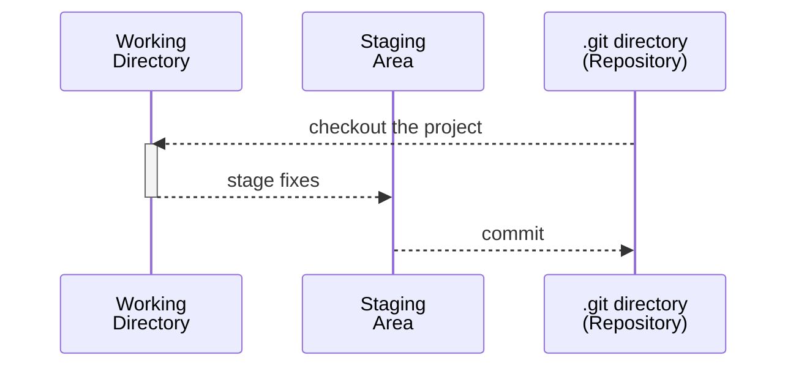

# Chapter 1: Getting Started

## The 3 States of `.git`



## Command Line Basics

View where all `.gitconfig` settings are loaded from:

```shell
git config --list --show-origin
```

Creating a global `.gitconfig` identity for the current logged in user (will be created in `$HOME/.gitconfig`):

```shell
git config --global user.name "John Doe"
git config --global user.email "johndoe@personalemail.com
```

If the identity is only for a repository, ignore the `--global` flag:

```shell
git config user.name "John Doe"
git config user.email "johndoe@workemail.com
```

To check the configuration settings of `.gitconfig` on your current repository:

```shell
git config --list
```
