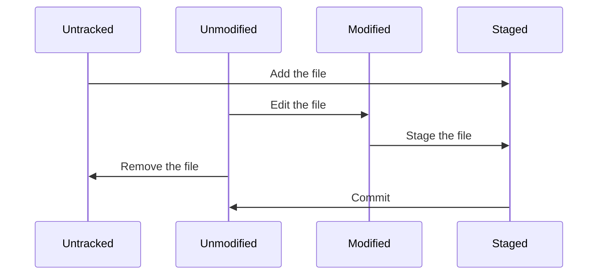

## Lifecycle of the Status of a File

```mermaid
sequenceDiagram
    participant utrack as Untracked
    participant umod as Unmodified
    participant mod as Modified
    participant stage as Staged

    utrack->>stage: Add the file
    umod->>mod: Edit the file
    mod->>stage:Stage the file
    umod->>utrack:Remove the file
    stage->>umod:Commit
```
