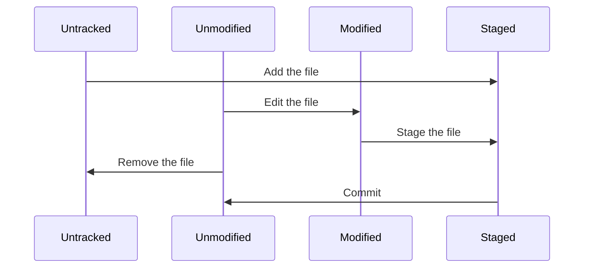

# Chapter 2: Git Basics

## Lifecycle of the Status of a File



## More on the `git status` Command

- `git status`: Show the status of changes as untracked, modified, or staged.

    ```shell
    git status
    ```

    ```shell
    On branch 2024-10-21_pro-git
    Changes not staged for commit:
    (use "git add <file>..." to update what will be committed)
    (use "git restore <file>..." to discard changes in working directory)
            modified:   README.md
            modified:   pro-git/chapter-01/README.md

    Untracked files:
    (use "git add <file>..." to include in what will be committed)
            pro-git/chapter-02/

    no changes added to commit (use "git add" and/or "git commit -a")
    ```

- Shorter `git status`:

    ```shell
    git status --short
    ```

    ```shell
     M README.md
     M pro-git/chapter-01/README.md
    ?? pro-git/chapter-02/
    ```

  - the first column represents the status of the staging area[^1]
  - the second column represents the status of the working directory[^1]

## Ignoring Files

Rules of `.gitignore` files:

- Blank lines or lines starting with `#` are ignored.
- Standard [glob patterns](#glob-patterns) work, and will be applied recursively throughout the entire working directory (e.g. `*.log`).
- You can start patterns with a forward slash (`/`) to avoid recursivity (e.g. `/*.log`).
- You can end patterns with a forward slash (`/`) to specify a directory (e.g. `log/`).
- You can negate a pattern by starting it with an exclamation point (`!`).

### Glob patterns

Glob patterns are regex[^2] for shell environments. Here are some examples:

- `*`: matches zero or more characters
- `[abc]`: matches any of the characters a, b, or c
- `?`: matches a single character
- brackets enclosing characters separated by a hyphen (`-`) represent a range (e.g. `[1-5]` matches any digit from 1 to 5)
- two asterisks (`**`) represent any number of directories (e.g. `a/**/z` matches `a/z`, `a/b/z`, `a/b/c/z`, etc.)

### Example `.gitignore` file[^3]

```gitignore
# ignore all .a files
*.a

# but do track lib.a, even though you're ignoring .a files above
!lib.a

# only ignore the TODO file in the current directory, not subdir/TODO
/TODO

# ignore all files in any directory named build
build/

# ignore doc/notes.txt, but not doc/server/arch.txt
doc/*.txt

# ignore all .pdf file in the doc/ directory and any of its subdirectories
doc/**/*.pdf
```

## Compare Changes Made with `git diff`

Use `git status` as a primer for this:

```shell
git status
```

```shell
On branch 2024-10-21_pro-git
Changes not staged for commit:
  (use "git add <file>..." to update what will be committed)
  (use "git restore <file>..." to discard changes in working directory)
        modified:   README.md
        modified:   pro-git/chapter-01/README.md

Untracked files:
  (use "git add <file>..." to include in what will be committed)
        pro-git/chapter-02/

no changes added to commit (use "git add" and/or "git commit -a")
```

Let's check what was changed in `README.md`:

```shell
git diff README.md
```

```shell
diff --git a/README.md b/README.md
index 74889a8..b4e04ff 100644
--- a/README.md
+++ b/README.md
@@ -6,4 +6,4 @@ Contains a collection of READMEs for the various areas of my learning. Some exer
 
 - [GNU `grep` and `ripgrep`](gnu-grep/)
 - [LDAP](ldap/)
-- [Pro Git](pro-git/)
\ No newline at end of file
+- [Pro Git](pro-git/)
```

## Removing Files from the Staging Area, but Retaining in the Working Directory

```shell
git rm --cached FILENAME
```

This way, the file will no longer be tracked, but you want to retain in the working directory — perhaps to be added to the `.gitignore` file.

[^1]: [See Chapter 01](../chapter-01/README.md) for more information on the staging area and the working directory.
[^2]: Regular expressions
[^3]: [Examples from GitHub](https://github.com/github/gitignore)
