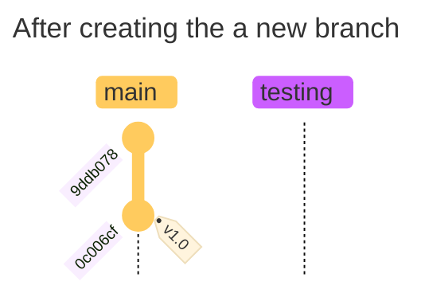
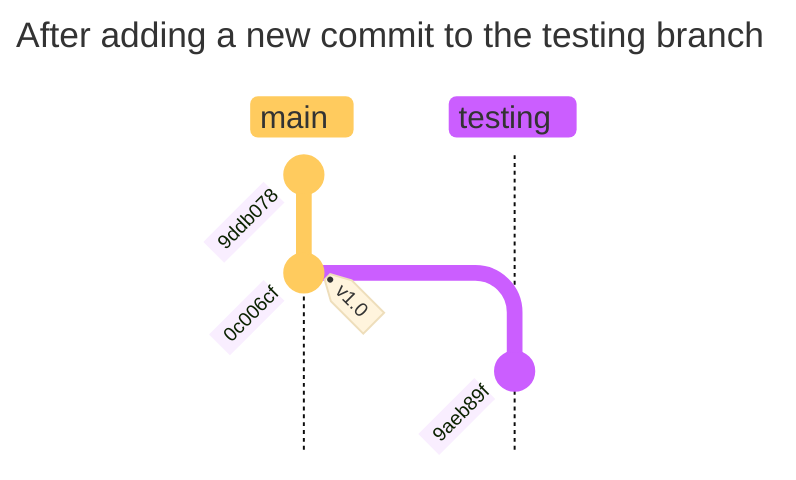
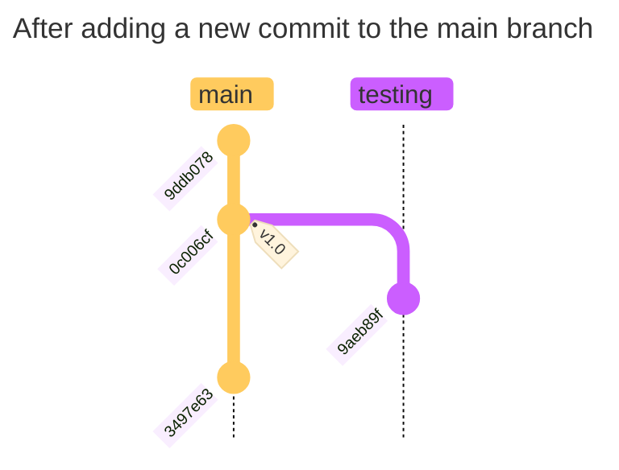

# Introduction

## Branching in a Nutshell

1. Staging a file in a repository calculates the checksum of the files being added, and adds it to the staging area. Files are stored as **blobs** in the Git database.
1. When a commit is made, that checksum is then written to the repository as a tree object.
1. Git then creates a commit object that has the metadata and a pointer to the root project tree so it can re-create that snapshot when needed.
1. The Git repository now contains **five** objects:

    - _three_ blobs (one for the contents of the file, and two for the `README.md` and `CONTRIBUTING.md` files)
    - _one_ tree that lists the contents of the directory and specifies which file names are stored as which blobs
    - _one_ commit that has the pointer to the root project tree and all the commit metadata.

    ```shell

    # The initial commit in the Git repository

    0c006cf

       commit    size

         tree    9ddb078
       author    Justin
    committer    Justin

    ---

    # The tree object

    9ddb078

    tree    size
    blob    b9113b9    README.md
    blob    a89a6ab    LICENSE
    tree    d511756    test.rb
    ```

    > [!TIP]
    > - To view a `tree` SHA for a Git repository, you can use the following commands:
    >
    >    ```shell
    >    ## get the commit SHA using `git log`
    >    git log --pretty=format:"%h : %s"
    >   
    >    0c006cf : Initial commit
    >   
    >    ## get the tree SHA using the commit SHA
    >    git cat-file -p 0c006cf
    >   
    >    tree 9ddb07813a9cc707569fa029ad24f7e200187630
    >    author Justin Alex Paramanandan <1155821+jusuchin85@users.noreply.github.com> 1732487779 +1100
    >    committer Justin Alex Paramanandan <1155821+jusuchin85@users.noreply.github.com> 1732487779 +1100
    >    gpgsig -----BEGIN PGP SIGNATURE-----
    >    
    >     iHUEABYKAB0WIQQb6UuYiQtlMxxvSUaJ2JZEKLX++AUCZ0OqYwAKCRCJ2JZEKLX+
    >     +E7UAP9OAQVPGo3mk3ZKC3rXepuADQL/qo6eBbdlgJKSpoYLmAEAoU1843WmN9ej
    >     s0ONrCKjX0ClibL1I1cvwA8aGVeg4QE=
    >     =iGqG
    >     -----END PGP SIGNATURE-----
    >    
    >    Initial commit
    >    ```
    >
    > - To view the list of SHAs for that `tree`, run the `git cat-file -p <tree SHA>` command.
    >
    >    ```shell
    >    git cat-file -p 9ddb07813a9cc707569fa029ad24f7e200187630
    >
    >    100644 blob a89a6abb86c0e88888f85da8bad678c81f72c338 LICENSE
    >    100644 blob b9113b90b3689331b4435ff899d4467f9f31d542 README.md
    >    100644 blob d5117561cd9fec95e4736e0f29ae1430dc849ce1 test.rb
    >    ```

- When you make some changes and commit again, the next commit stores a pointer to the commit that came immediately before it.

    ```shell

    # The initial commit in the Git repository

    0c006cf

       commit    size

         tree    9ddb078
       parent
       author    Justin
    committer    Justin

    ---

    # The next commit object
    # "Add command to output my name to test.rb"

    c073b74

       commit    size

         tree    9b244c2
       parent    0c006cf
       author    Justin
    committer    Justin

    ```

- A branch is essentially a lightweight pointer to one of these commits. The default branch name in Git is `main`. When you make a commit, the `main` branch is updated to point to the new commit.

    ```mermaid
    ---
    title: Current State of Repository
    ---
    %%{init: { 'logLevel': 'debug', 'theme': 'base' } }%%
    gitGraph TB:
        commit id: "9ddb078"
        commit id: "0c006cf" tag: "v1.0"

    ```

## Creating a New Branch

New branches gets created **from the branch where you execute the `git branch` command**.

```shell
git branch testing
```

This creates a new pointer to the same commit you’re currently on.



Git knows this by basing on the `HEAD` pointer, which is a pointer to the local branch you’re currently on.

You've just created a new branch, but you're not actually in the branch yet (`HEAD` is still pointing to `main` branch).:

```shell
git log --oneline --decorate
```

```shell
c073b74 (HEAD -> main, origin/main, testing) Add command to output my name
0c006cf Initial commit
```

From the above, you can see that `main` and `testing` branches are referencing the same commit SHA (`c073b74`).

## Switching Branches

To switch to an existing branch, you can use the `git checkout` command:

```shell
git checkout testing
```

This will move the `HEAD` pointer to point to the `testing` branch:

```shell
git log --oneline --decorate
```

```shell
c073b74 (HEAD -> testing, origin/main, main) Add command to output my name
0c006cf Initial commit
```

Now, let's do a new commit on the `testing` branch:

```shell
vim test.rb
git commit --all --message "Update test.rb to print current date and time"
```



The interesting thing here is that the `main` branch is still referencing the same commit SHA (`c073b74`), while the `testing` branch has moved on to a new commit SHA (`9aeb89f`). Let's switch back to the `main` branch:

```shell
git checkout main
```

```shell
git log --oneline --decorate
```

```shell
c073b74 (HEAD -> main, origin/main) Add command to output my name
0c006cf Initial commit
```

> [!WARNING]  
> Note that `git log` doesn't always show all _branches_ all the time.
> When we ran `git log` previously, it doesn't show the `testing` branch. This is because Git shows you which branches it _thinks_ you're interested in. In this case, since we're on the `main` branch, Git only shows you the history of the `main` branch.
> To see the history of the `testing` branch, you can run `git log testing`. This is a useful command to learn more about a particular branch.
>
> ```shell
> git log testing
> ```
> 
> ```
> commit 9aeb89faa4de6058b75c936ffcdf274d857641fa (testing)
> Author: Justin Alex Paramanandan <1155821+jusuchin85@users.noreply.github.com>
> Date:   Mon Nov 25 10:52:13 2024 +1100
> 
>     Update test.rb to print current date and time
> 
> commit c073b74754b063019c11a8324c7d31c815d85f8b (HEAD -> main, origin/main)
> Author: Justin Alex Paramanandan <1155821+jusuchin85@users.noreply.github.com>
> Date:   Mon Nov 25 10:25:41 2024 +1100
> 
>     Add command to output my name
> 
> commit 0c006cf960db88a4345842b4af005abf66d789e3
> Author: Justin Alex Paramanandan <1155821+jusuchin85@users.noreply.github.com>
> Date:   Mon Nov 25 09:36:19 2024 +1100
> 
>     Initial commit
> ```

When switching branches, the `HEAD` pointer moves to the latest commit of the branch you're switching to. It also reverts the files in your working directory back to the state they were in at the time of the commit you move to. This also means that any changes from this point forward will diverge from an older version of this project.

**In a nutshell, it rewinds all work that was done on the `testing` branch so you can move in a different direction.**

> [!WARNING]  
> Switching branches reverts **all** changes made on the working directory. If Git cannot do this cleanly, it'll not let you to switch at all.

Let's make a few changes and commit again:

```shell
vim test.rb
git commit --all --message "Update test.rb to print my name and age"
```

Your project history has now diverged (work done in both the `main` and `testing` branches). Both branches have their own commit that the other one doesn't know about:



You can also view these changes with the `git log` command:

```shell
git log --oneline --decorate --graph --all
```

```shell
* 3497e63 (HEAD -> main) Update test.rb to print my name and age
| * 9aeb89f (testing) Update test.rb to print current date and time
|/
* c073b74 (origin/main) Add command to output my name
* 0c006cf Initial commit
```

Because branches are just a simple file that contains 40 character SHA-1 checksums of the commit they point to, they are cheap to create and destroy (new branches adds 41 bytes to a file — 40 for the SHA-1, and 1 for the newline).
