# Basic Branching and Merging

Here's a typical branching scenario:

1. You're working on your project and you want to add a new feature.
1. You create a new branch in your project.
1. You do your work in this branch.
1. You receive a call that there's a critical bug in production that needs fixing.
1. You switch back to your `main` branch.
1. You create a new branch to fix the bug.
1. After the bug is fixed, you merge the bugfix branch back into `main`.
1. You switch back to your feature branch and continue working on your feature.

## Basic Branching

Here's a model of the current repository with two commits in the `main` branch:

```shell
git log --pretty=format:"%h : %s"

3497e63 : Update test.rb to print my name and age
c073b74 : Add command to output my name
0c006cf : Initial commit
```

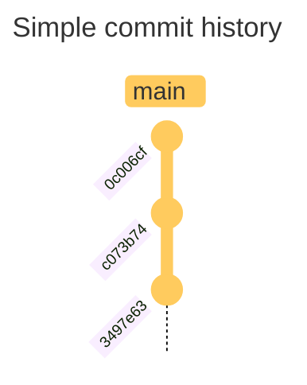

You then started working on issue #53. You start by creating a new branch:

```shell
git checkout -b iss53                                 
Switched to a new branch 'iss53'
```

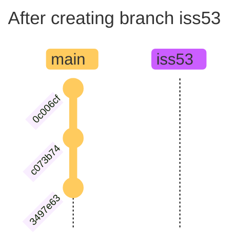

You do some work and commit a few times:

```shell
git commit --all --message "Add timestamp and author"
[iss53 efe0e1e] Add timestamp and author
 1 file changed, 2 insertions(+)
```

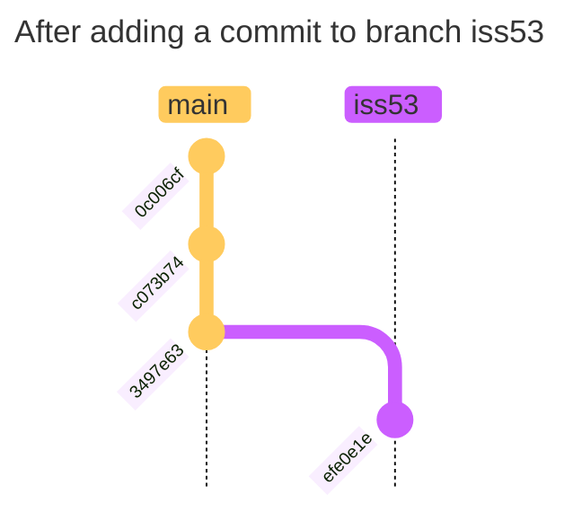

At this point, someone reported a critical issue that needs to be fixed immediately. With Git, you don't need to write the fix in `iss53`. What you can do instead is switch back to the `main` branch, create the hotfix branch and then work on that branch instead:

```shell
git checkout main
Switched to branch 'main'

git checkout -b hotfix
Switched to a new branch 'hotfix'
```

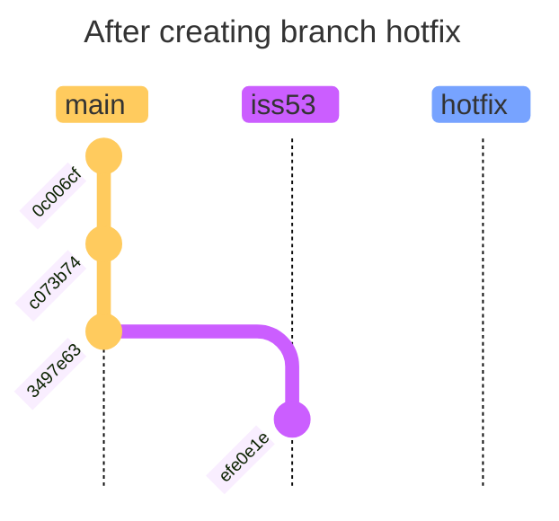

You commit the fix:

```shell
git commit --all --message "Fix by adding state"     
[hotfix 55bd8de] Fix by adding state
 1 file changed, 2 insertions(+), 1 deletion(-)
```

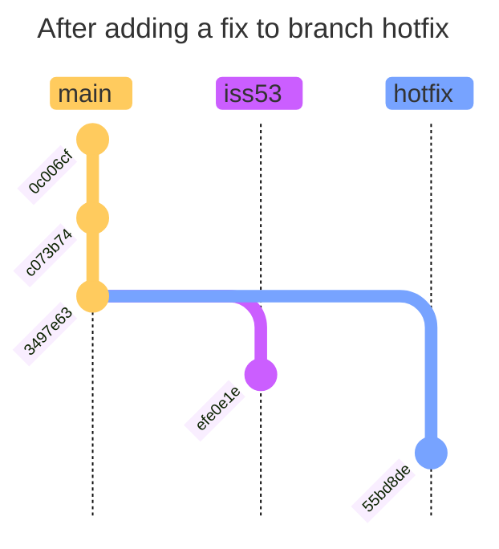

After you've fixed the bug, you merge the `hotfix` branch back into `main`:

```shell
git co main                                     
Switched to branch 'main'

git merge hotfix 
Updating 3497e63..55bd8de
Fast-forward
 test.rb | 3 ++-
 1 file changed, 2 insertions(+), 1 deletion(-)
```

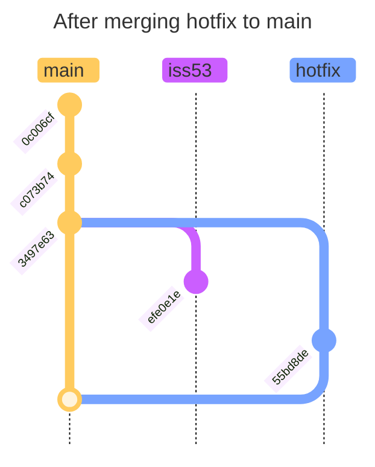

You'll notice the `merge` is a "fast forward" because the `hotfix` branch contains all the changes that are in `main`. Since there are no new commits in `main` after commits are introduced in the `hotfix` branch, Git simply moves the `main` pointer up to the same commit that `hotfix` points to (i.e. no divergent work to merge together).

After the merge, you can delete the `hotfix` branch:

```shell
git branch -d hotfix
Deleted branch hotfix (was 55bd8de).
```

You can then continue working on your `iss53` branch:

```shell
git checkout iss53
git commit --all --message "Add another timestamp and author"
[iss53 be60193] Add another timestamp and author
 1 file changed, 1 insertion(+)
```

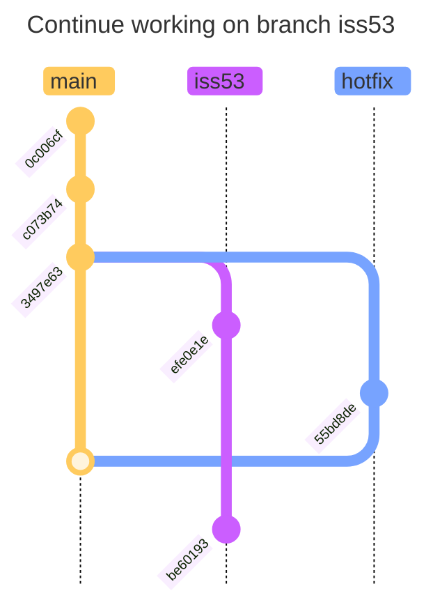

## Basic Merging

At this point, you've done some work on the `iss53` branch, and it's ready to be merged back into `main`. You can do this with the `git merge` command:

```shell
git checkout main                                                  
Switched to branch 'main'

git merge iss53  
Merge made by the 'ort' strategy.
 README.md | 3 +++
 1 file changed, 3 insertions(+)
```

The merge is different from the previous one because the `iss53` branch has diverged from `main` since it was created (this is due to some work being done in the `hotfix` branch earlier). Since the first commit in `iss53` is not a direct ancestor of the last commit in `main`, Git has to do some work to merge the two together. The `ort` strategy is the default strategy Git uses to merge. It's a very good general-purpose merge strategy.

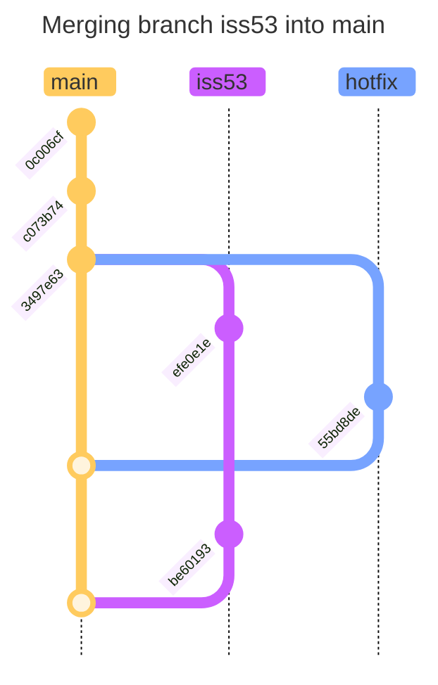

Instead of just moving the `main` branch to the same commit as `iss53`, Git creates a new commit to record the merge. This is referred to as a "merge commit" and is special in the sense that it has more than one parent. In this case, it's the two commits that were merged together.

After the merge, you can delete the `iss53` branch:

```shell
git branch -d iss53
Deleted branch iss53 (was be60193).
```

## Basic Merge Conflicts

Sometimes, the changes in the branches that you're merging can't be automatically merged by Git. This is called a "merge conflict". For example, if you changed the same part of the same file differently in the branch that you're merging in, Git won't be able to merge them cleanly.

Let's simulate this with the same scenario as above, but this time our `hotfix` branch is going to update the same file we're updating in our feature branch.

```shell
git checkout -b iss54
git commit --all --message "Add district"                    
[iss54 7fd28c8] Add district
 1 file changed, 2 insertions(+), 1 deletion(-)
```

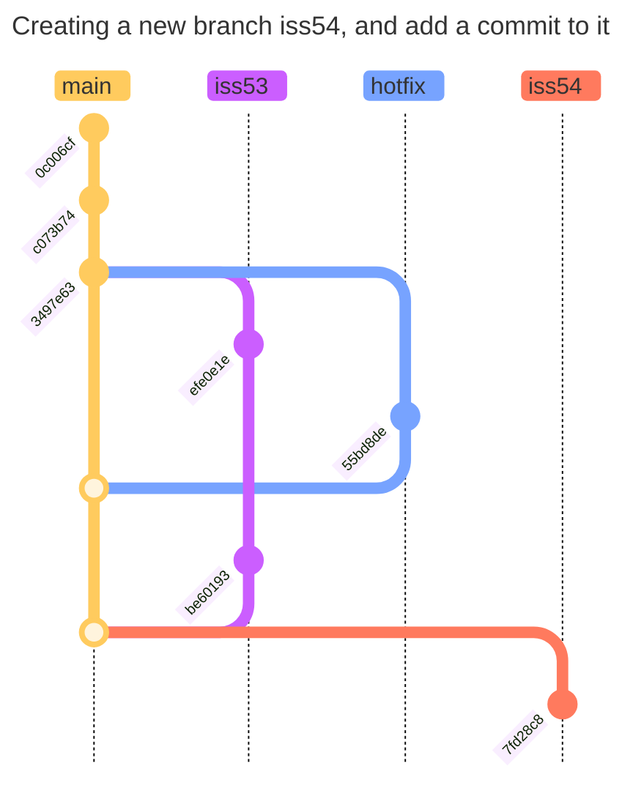

```shell
git checkout main
git checkout -b hotfix-2
it commit --all --message "Fix name to fullname"
[hotfix-2 47d2436] Fix name to fullname
 1 file changed, 2 insertions(+), 2 deletions(-)

git checkout main
git merge hotfix-2
Updating 7e8ca91..47d2436
Fast-forward
 test.rb | 4 ++--
 1 file changed, 2 insertions(+), 2 deletions(-)
```

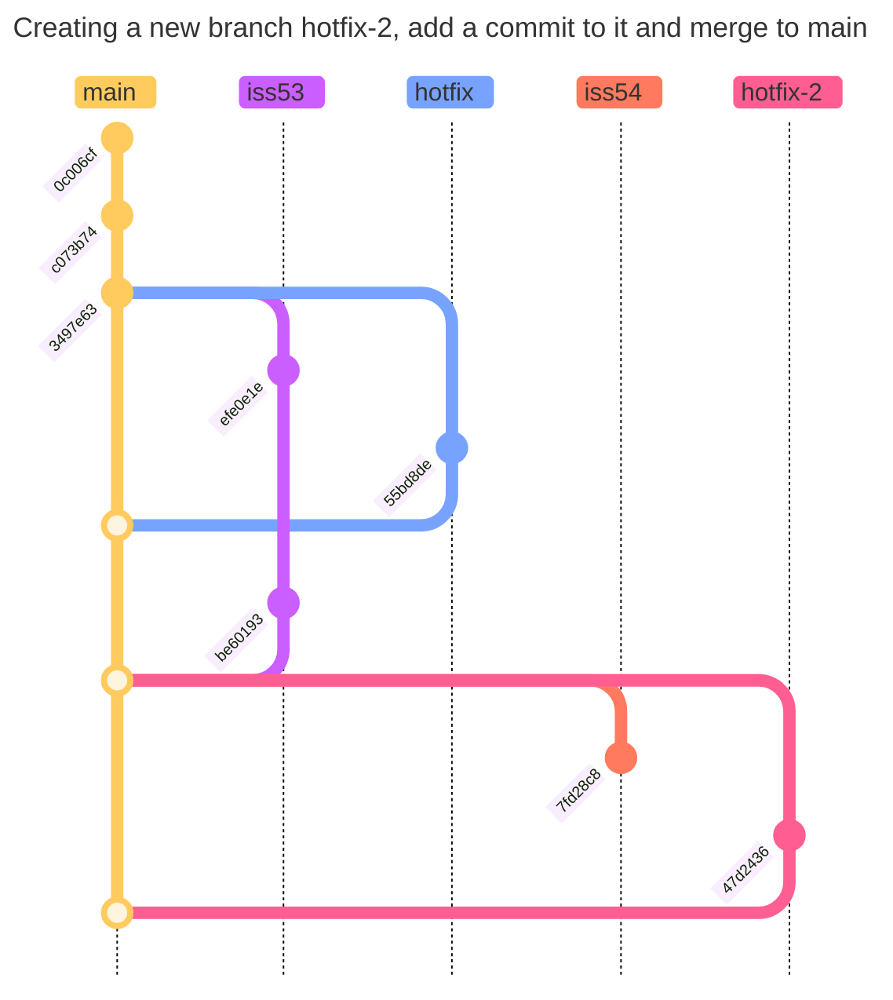

```shell
git merge iss54
Auto-merging test.rb
CONFLICT (content): Merge conflict in test.rb
Automatic merge failed; fix conflicts and then commit the result.
```

Notice that the merge commit was not created because of the conflict. The `merge` process is currently paused until the conflict is resolved. You can check the status of the merge by running `git status`:

```shell
git status      
On branch main
Your branch is ahead of 'origin/main' by 6 commits.
  (use "git push" to publish your local commits)

You have unmerged paths.
  (fix conflicts and run "git commit")
  (use "git merge --abort" to abort the merge)

Unmerged paths:
  (use "git add <file>..." to mark resolution)
        both modified:   test.rb

no changes added to commit (use "git add" and/or "git commit -a")
```

Anything that has a conflict will be listed as "unmerged". You can open the file in your editor, and you'll see the conflict markers:

```ruby
puts "Hello, World!"

# Print my name and age
fullname = "Justin"
age = 35
district = "San Francisco"
state = "California"

<<<<<<< HEAD
puts "Name: #{fullname}, Age: #{age}, State: #{state}"
=======
puts "Name: #{name}, Age: #{age}, District #{district}, State: #{state}"
>>>>>>> iss54
```

- the version of `test.rb` in `HEAD` (in your `main` branch) is at the top of the file (everything above the `=======` line)
- the version of `test.rb` in `iss54` is below the `=======` line

In order to resolve the conflict, you would either:

- choose one side or the other, or
- write a new version that incorporates elements from both sides

We decide to merge both commits into one:

```ruby
puts "Hello, World!"

# Print my name and age
fullname = "Justin"
age = 35
district = "San Francisco"
state = "California"

puts "Name: #{fullname}, Age: #{age}, District #{district}, State: #{state}"
```

> [!WARNING]
> When resolving merge conflicts, ensure that you remove all traces of `<<<<<<<`, `=======` and `>>>>>>>`. Failing to do so will block your merge commit later.

After resolving the conflict, you need to stage the file:

```shell
git add test.rb

git status     
On branch main
Your branch is ahead of 'origin/main' by 6 commits.
  (use "git push" to publish your local commits)

All conflicts fixed but you are still merging.
  (use "git commit" to conclude merge)

Changes to be committed:
        modified:   test.rb
```

Once you're happu with the resolution, you can commit the merge:

```shell
git commit
```

The default commit message is pre-populated with some helpful information about the merge. You can keep it as is, or modify it to better reflect the changes you've made:

```shell
Merge branch 'iss54'

# Conflicts:
#   test.rb
#
# It looks like you may be committing a merge.
# If this is not correct, please run
#   git update-ref -d MERGE_HEAD
# and try again.


# Please enter the commit message for your changes. Lines starting
# with '#' will be ignored, and an empty message aborts the commit.
#
# On branch main
# Your branch is ahead of 'origin/main' by 6 commits.
#   (use "git push" to publish your local commits)
#
# All conflicts fixed but you are still merging.
#
# Changes to be committed:
#   modified:   test.rb
#
```

We're going to update the merge commit to make more sense on how we resolve the merge conflict:

```shell
Merge branch 'iss54'

Fixed merge conflict by incorporating both the hotfix (i.e. "fullname"
field) and include the "district" field in the output.

# Conflicts:
#   test.rb
#
# It looks like you may be committing a merge.
# If this is not correct, please run
#   git update-ref -d MERGE_HEAD
# and try again.


# Please enter the commit message for your changes. Lines starting
# with '#' will be ignored, and an empty message aborts the commit.
#
# On branch main
# Your branch is ahead of 'origin/main' by 6 commits.
#   (use "git push" to publish your local commits)
#
# All conflicts fixed but you are still merging.
#
# Changes to be committed:
#   modified:   test.rb
#
```

Once you've committed, you'll notice the following message — indicating that the merge is complete:

```shell
[main c207cf3] Merge branch 'iss54'

git log --pretty=format:"%h : %s"

c207cf3 : Merge branch 'iss54'
47d2436 : Fix name to fullname
7fd28c8 : Add district
7e8ca91 : Merge branch 'iss53'
be60193 : Add another timestamp and author
55bd8de : Fix by adding state
efe0e1e : Add timestamp and author
3497e63 : Update test.rb to print my name and age
c073b74 : Add command to output my name
0c006cf : Initial commit
```

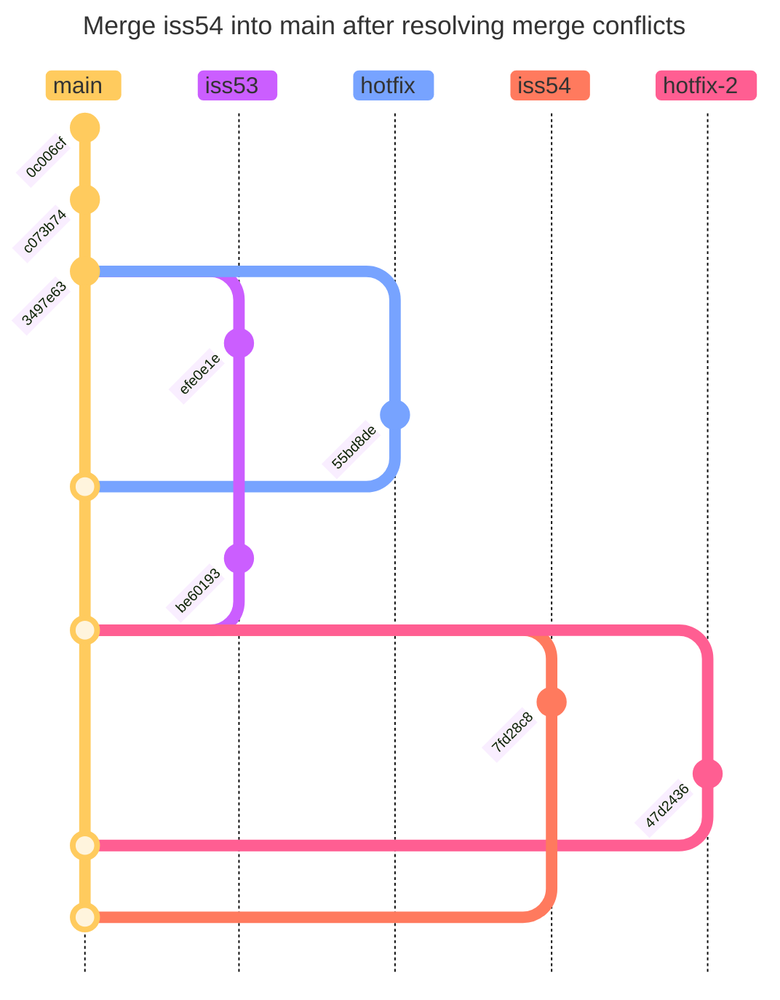
